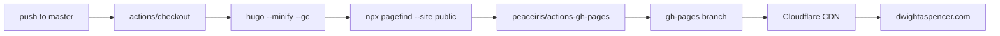
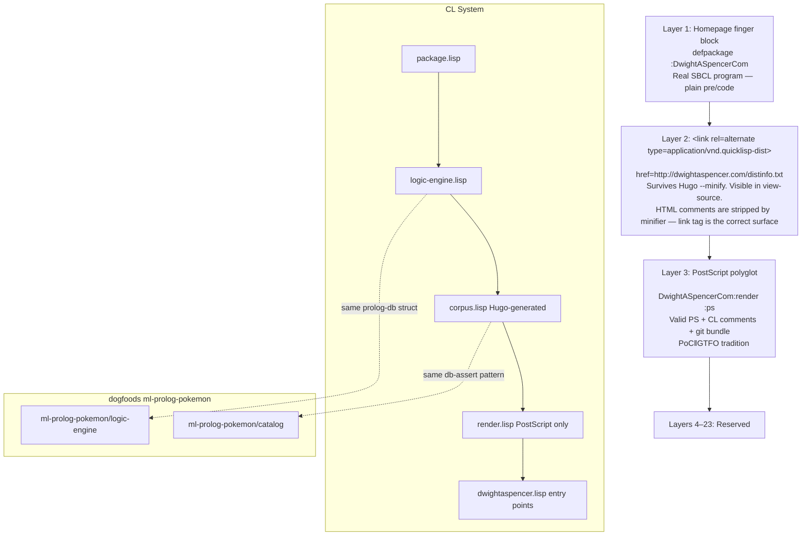
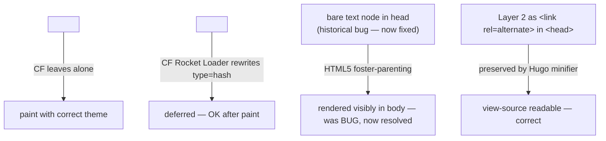
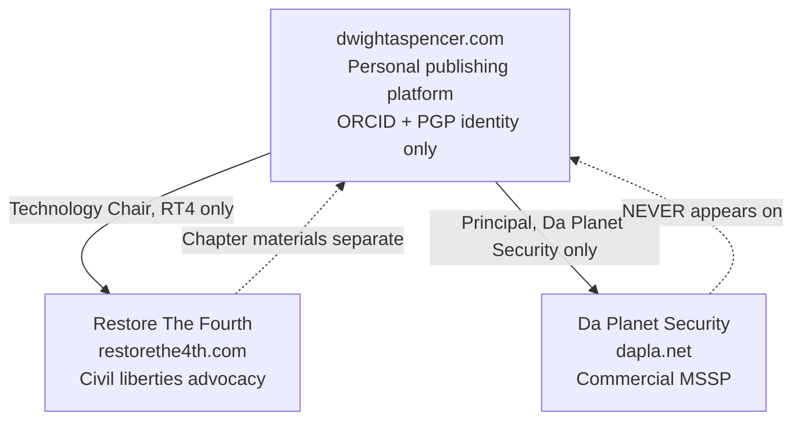
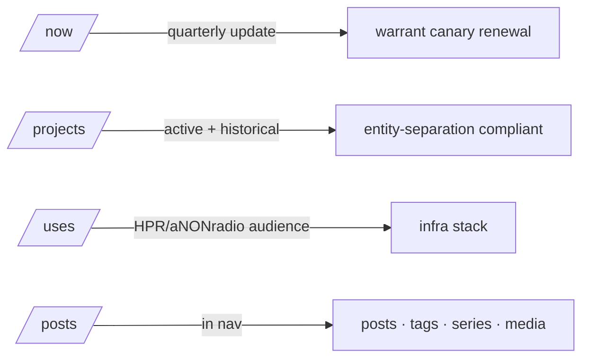

# dwightaspencer.com Architecture

## Site build pipeline

```mermaid
graph LR
    A[hugo/data/author.yaml] --> B[partials/finger.html]
    A --> C[index.lisp]
    A --> D[index.humans]
    A --> E[partials/head.html]
    F[hugo/content/posts/*.md] --> C
    F --> G[_default/single.html]
    C --> H[/corpus.lisp Hugo-generated — at site root]
    D --> I[/humans.txt Hugo-generated]
    B --> J[index.html finger block]
    G --> K[/posts/NN-slug/]
    L[taxonomy/tag.terms.html] --> M[/tags/ frequency-weighted]
    N[taxonomy/series.terms.html] --> O[/series/ arc index]
    P[hugo/static/lisp/*.lisp] --> Q[Quicklisp dist: /distinfo.txt at root, /lisp/ for tgz+indexes]
    R[hugo build] --> S[npx pagefind]
    S --> T[/pagefind/ search index]
```

## GH Actions deploy pipeline



## The Lisp system layers



## Cloudflare interaction



## Entity separation



## Content taxonomy (live)

```mermaid
graph LR
    P[posts] --> T[tags]
    P --> CA[categories]
    P --> SE[series]
    P --> VE[venue field only]
    T --> TI[/tags/ frequency-weighted]
    SE --> SI[/series/infrastructure-independence]
    SE --> SW[/series/the-watchers-you-fed]
    VE --> KD[KDP front matter only]
    VE --> HP[HPR front matter only]
```

## Pages (not in nav)


