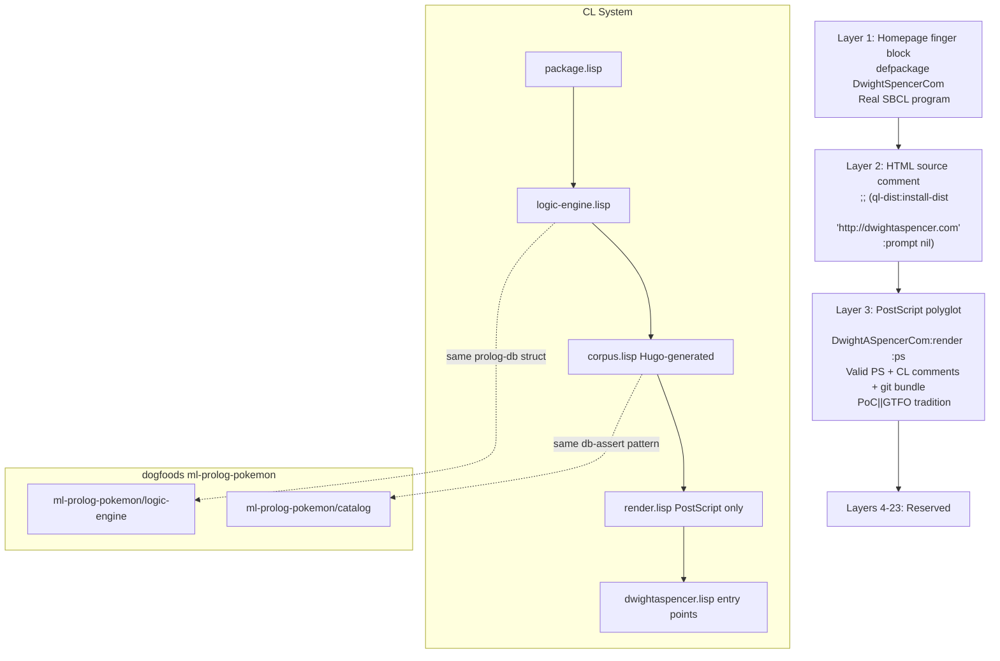
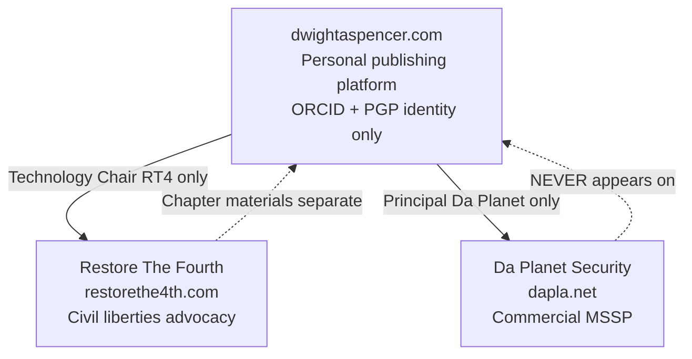

# dwightaspencer.com Architecture

## Site build pipeline

```mermaid
graph LR
    A[hugo/data/author.yaml] --> B[layouts/partials/finger.html]
    A --> C[layouts/index.lisp]
    A --> D[layouts/index.humans]
    A --> E[layouts/partials/head.html Schema.org]
    F[hugo/content/posts/*.md] --> C
    F --> G[layouts/_default/single.html]
    C --> H[/corpus.lisp auto-generated]
    D --> I[/humans.txt auto-generated]
    B --> J[index.html finger block]
    G --> K[/posts/NN-slug/]
    L[hugo/layouts/taxonomy/tag.terms.html] --> M[/tags/ frequency-weighted]
    N[hugo/static/lisp/*.lisp] --> O[Quicklisp dist at root]
```

## The Lisp system layers



## Entity separation



## Content taxonomy (current + v2.5)

```mermaid
graph LR
    P[posts] --> T[tags]
    P --> CA[categories]
    P --> SE[series v2.5]
    P --> NC[nist_controls v2.5]
    P --> VE[venue v2.5]
    NC --> NI[/nist/AC-3/ etc]
    SE --> SI[Infrastructure Independence]
    SE --> SW[The Watchers You Fed]
    VE --> AR[arXiv]
    VE --> KD[KDP]
    VE --> HP[HPR episodes]
```
