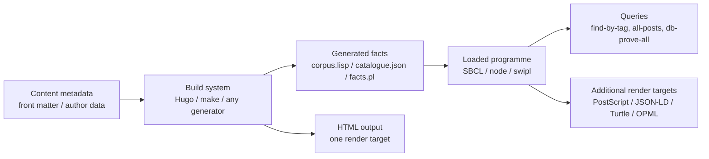
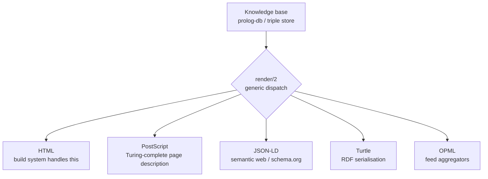
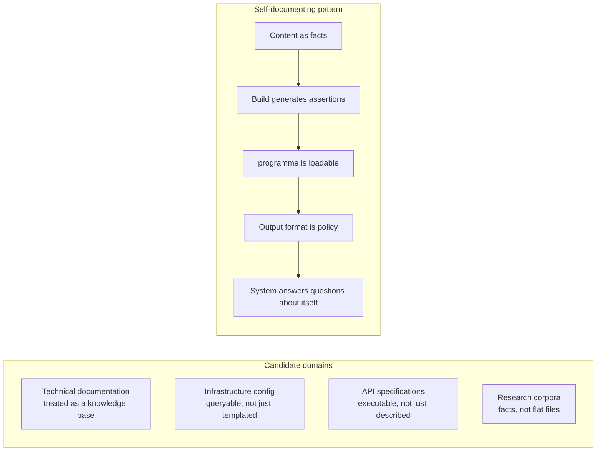

+++
title       = "Three Runtimes, One Site: A Case for Self-Documenting Infrastructure"
date        = "2026-05-24"
publishDate = "2026-06-01"
draft       = false
description = "On treating a website as a running program — content as queryable facts, build systems as code generators, and output formats as policy. A case for self-documenting infrastructure drawn from systems design principles."
slug        = "10-three-runtimes-one-site"
keywords    = ["common lisp", "self-documenting systems", "prolog", "postscript", "asdf", "static site", "architecture", "systems design", "sbcl", "knowledge base", "polyglot"]
tags        = ["infrastructure", "open-source", "architecture", "lisp"]
categories  = ["articles"]
series      = ["Infrastructure Independence"]
schema_type = "TechArticle"
aeo_expertise = "DevOps, Open Source, Architecture, Systems Design"
aliases     = ["/10-three-runtimes/"]
og_image    = "/assets/og-posts.png"

[related_post]
  slug  = "03-rules-types-and-glue"
  label = "post 03 covers the logic engine architecture in the Pokémon study context"
+++

<em>Assumes working familiarity with Lisp, a basic tolerance for
backward chaining, and an interest in what happens when you take the phrase
"the programme documents itself" literally.</em>

<h2 id="the-premise">programmes that know what they are</h2>

Smalltalk images could describe themselves. Emacs Lisp environments
answer questions about themselves. The original Lisp machines blurred
the distinction between the running programme and the documentation of
that programme — not as a metaphor, but as an implementation choice.
You could ask the system what it was and it would answer, from itself.

This tradition has a name: self-documenting systems. The defining
characteristic, developed at Xerox PARC and refined through the Lisp
machine lineage at MIT and beyond, is that the documentation and the
programme are the same artefact. Running the system
<em>is</em> reading the documentation. Querying it <em>is</em> exploring its
structure.

The web broke this. The dominant architecture — a build pipeline that
transforms content into static artefacts — is deeply passive. The site
does not know what it contains. It cannot be asked. It cannot reason
over itself. It is a directory tree with an HTTP server pointed at it.
This extends to the DOM and the surrounding toolchain: the structure,
discovery, and reasoning that web applications layer on top arrive
through JavaScript, XPath, CSS selectors, and external search indexes —
none of it intrinsic to the content, all of it bolted on.

This is a design choice, not a constraint.

<h2 id="what-violates-this">The limits of the pipeline model</h2>

Content management systems partially address the passivity problem
through REST and GraphQL APIs — the content is queryable, but the
queries live outside the system, in a separate layer that must be
maintained, versioned, and kept in sync. The content and the programme
that reasons about the content are separate artefacts that drift apart.

Static site generators go further in the wrong direction. The site at
rest has no runtime at all. Questions about the content — which posts
share a tag, what the publication order is, whether a given slug exists
— must be answered at build time, burned into the HTML output, and
re-asked at every build. The site cannot answer questions; it can only
have answers pre-baked into it.

The alternative is to treat the content as data in a running programme,
not as input to a transformation pipeline. The build system becomes a
code generator. The output is one representation among several. The
programme can be queried, loaded into a REPL, extended, and reasoned
over — by the same tools the author uses to write it.

<h2 id="content-as-facts">Content as queryable facts</h2>

The core design decision is representing content as first-class data
structures in the programme, not as files in a directory. Specifically:
each piece of content becomes a fact assertion in a knowledge base.

A minimal schema for a post corpus:

<pre><code>(post   slug title date word-count)
(tag    slug tag-name)
(author slug identifier)
</code></pre>

These facts can be asserted into any knowledge base implementation —
a relational database, a triple store, an in-memory Prolog database.
The choice of backing store determines what queries are natural to
express. A micro-Prolog engine over ground facts makes pattern matching
and unification the native query interface:

<pre><code>&#35; all posts tagged :infrastructure
(db-prove-all kb '(tag ?slug :infrastructure))

&#35; unification — find posts matching a pattern
(db-prove-all kb '(post ?slug ?title "2026-05-24" ?wc))
</code></pre>

A minimal Prolog implementation suffices. The query surface that matters
for a text corpus is selection and projection — backward chaining over
ground facts, unification for pattern matching, no cut, no arithmetic.
The engine is sized to the problem.

The payoff: the corpus is now a programme. It can be loaded, queried,
and extended with the same tools used to write any other programme in
the same language. The documentation and the data are unified.

<h2 id="the-build-system-as-codegen">The build system as compiler</h2>

If content is data in a programme, the build system's job changes. It is
no longer transforming content into HTML. It is compiling source —
specifically, the content metadata — into fact assertions, then also
rendering one output format (HTML) from the resulting programme.

This is the same pattern as any schema-driven code generator: the
schema (post front matter) is authoritative, the generated code
(fact assertions) follows from it. The generator runs at build time.
The generated code is valid source in the target language.

The content appears in three places: as source files the author writes,
as fact assertions the build system generates, and as rendered output
in whatever formats are useful. One source; multiple representations.
The build system is the ETL between them.

<h2 id="output-as-policy">Output format as policy, not mechanism</h2>

Once the programme exists separately from its rendered output, adding
a new output format is a new method, not a new pipeline. A generic
dispatch over output targets — a multimethod, a protocol, an interface —
keeps the rendering mechanism stable while making the policy extensible.

PostScript is worth dwelling on as a render target, not because it is
practical but because it is instructive. It is a Turing-complete stack
language — a general-purpose programming language whose output happens
to be pages. A PostScript file is a programme. That makes it a natural
target for a system where the content is already a programme.

More interestingly: PostScript's comment syntax is valid in several
other languages. A file that is simultaneously valid PostScript and
valid Common Lisp — where the PS renders a document and the Lisp
executes as a programme — demonstrates that the boundary between document
and programme is a convention. Researchers working in binary analysis,
steganography, and format parsing have explored this boundary
systematically; the Turing completeness of PostScript makes it
one of the more productive surfaces for that work.

The same reasoning applies to the relationship between Lisp source and
documentation. A Lisp form is already a data structure — a tree — the
same structure that document systems use to represent content.
The correspondence is not coincidental.

<h2 id="the-finger-block">The finger block as executable documentation</h2>

Lisp has a long history in document systems precisely because of this
correspondence. RFCs used pseudo-Lisp for algorithm descriptions from
the 1970s onward. SGML and early XML tooling leaned on Lisp for
transformation. Code that reads as pseudocode — and pseudocode that
compiles as code — is not an accident in Lisp; it follows from
the syntax being a data structure.

A finger block rendered as a <code>defpackage</code> form with a shebang line
takes this literally. The block on the homepage is valid pseudocode
describing the author's identity and capabilities. It is also a
runnable SBCL script — the shebang is there, the forms are syntactically
correct, executing it produces output. The documentation is the programme.
The programme is the documentation. Neither is primary.

This is not a new idea. It is a very old idea that fell out of fashion
when the industry decided that documentation and code were different
artefact types that happened to describe the same thing, rather than
the same artefact type viewed from different perspectives.

<h2 id="applying-the-pattern">Applying the pattern</h2>

The pattern generalizes beyond personal sites. Any system where content
or configuration is read by humans and also reasoned over by programmes
is a candidate:

The implementation language is not the point. The pattern works in
Common Lisp, in Prolog directly, in Datalog, in any system where
facts can be asserted and queried with the same tools used to write
the programme. The choice of language determines what queries are
idiomatic, not whether the pattern is applicable.

What changes when you apply it: the build system becomes a code
generator, not a transformation pipeline. The content gains a
query interface. New output formats are new methods, not new pipelines.
The system can be introspected from a REPL rather than only inspected
as files on disk.

What does not change: the content is still written by humans, the
primary output is still whatever format the audience reads, and the
build still runs on every change. The difference is that the artefact
produced by the build is a programme, not just a directory tree.

