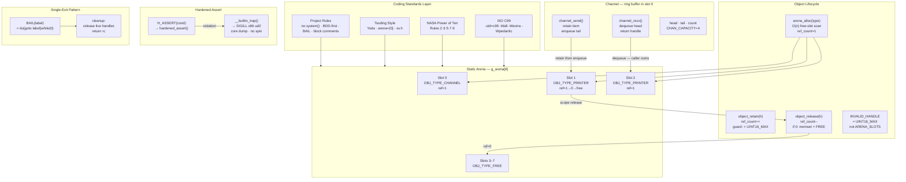

+++
title       = "Owning Your Memory: Hardened Arenas, Channels, and Structural OOP in Pure C99"
date        = "2026-05-29"
draft       = false
description = "The security industry keeps chasing new languages while shipping new supply chain attack surfaces. Here is how to build a reference-counted arena, a non-blocking channel, and structural OOP dispatch in 100% standard C99 — auditable in one sitting, zero dependencies, zero heap."
slug        = "11-owning-your-memory"
keywords    = ["c99", "arena allocator", "memory safety", "supply chain", "nasa power of ten", "systems programming", "devops", "infosec", "open source", "sovereignty"]
tags        = ["c99", "systems", "devops", "infosec", "architecture", "open-source", "privacy", "sovereignty"]
categories  = ["articles"]
series      = ["Infrastructure Independence"]
schema_type = "TechArticle"
aeo_expertise = "DevOps, Security, Open Source, Systems Programming, C99"
aliases     = ["/11-owning-your-memory/"]
og_image    = "/assets/og-posts.png"

[[diagrams]]
  title   = "Architecture overview: coding standards, arena, object lifecycle, channel, assert, single-exit"
  alt     = "Flowchart showing six layers: ISO C99, NASA Power of Ten Rules 2 3 5 7 9, Tsoding Style with Yoda conditions and arena zero-init, and project rules including no system calls, BDD-first, BAIL macro, and block comments feed into a static arena of eight slots. Object lifecycle shows arena_alloc O(n) free-slot scan, object_retain incrementing ref_count guarded below UINT16_MAX, and object_release decrementing with memset and FREE on zero. INVALID_HANDLE is UINT16_MAX not ARENA_SLOTS. Channel is a ring buffer in slot zero with channel_send retaining and enqueuing at tail and channel_recv dequeuing from head. Hardened assert uses H_ASSERT calling hardened_assert which calls __builtin_trap producing SIGILL on x86 via ud2 with core dump and no spin loop. Single-exit pattern uses BAIL macro expanding to do goto label while zero feeding a cleanup block that releases live handles and returns rc."
  caption = "Post 11 architecture: standards layer → arena → object lifecycle → channel → hardened assert → single-exit cleanup"
+++

<em>Assumes working familiarity with C, a basic tolerance for
explicit memory ownership, and an interest in what happens when you take
the phrase &#8220;auditable in one sitting&#8221; literally.</em>

<h2 id="the-wrong-question">The industry keeps asking the wrong question</h2>

The security industry has a recurring fantasy: that the right <em>new</em> language
will solve memory safety. Write it in Rust. Rewrite it in Go. Transpile it
through a supply chain of npm packages blessed by a foundation whose funding
you have not audited. The CVEs will stop. The exploits will dry up.

They do not. They move. The attack surface migrates from your allocator into
your build toolchain, your package registry, your compiler plugin ecosystem,
your language runtime&#8217;s own memory model. You traded a known adversary for
three unknown ones and called it progress.

This post takes the opposite position: use what already works, follows
ratified standards, and can be audited without a PhD in type theory. The
toolchain is a 1989 standard that has outlasted every hype cycle since. The
patterns here are deployed in avionics, hypervisors, and the kernels running
under the clouds everyone else depends on. They are not exotic. They are just
unfashionable &#8212; which is a different thing.

<h2 id="supply-chain">The supply chain you are not thinking about</h2>

Before the code: a threat model.

Every dependency you pull is a trust decision. A Rust crate, a Go module, a
Node package &#8212; each one is an executable that runs with your process&#8217;s
privileges at build time or runtime. The registries that serve them have been
compromised before and will be again. The maintainers are often one
burned-out volunteer whose GPG key management you have never audited.

C99 with zero external dependencies is not a limitation. It is a security
posture. The complete dependency graph for <code>example.c</code> is:

<pre><code>&lt;stdio.h&gt;   — your libc
&lt;stdint.h&gt;  — your libc
&lt;string.h&gt;  — your libc
</code></pre>

That is the entire supply chain. You can read all of it. Your auditor can
read all of it. The provenance is the C standard published in 1999 and the
POSIX libc your OS ships. No registry. No lockfile. No SBOM with 847 entries
you generated and never read.

<h2 id="coding-standards">Coding standards in force</h2>

The code in this post applies a documented, layered set of standards.
Understanding them is prerequisite to reading the implementation.

<strong>ISO C99 (ISO/IEC 9899:1999)</strong> &#8212; the base language standard. No GNU
extensions, no <code>__attribute__</code>, no C11 atomics. Every construct is valid
under <code>-std=c99 -Wall -Wextra -Wpedantic</code> with zero warnings on GCC and Clang.

<strong>NASA Power of Ten</strong> (Gerard Holzmann, JPL, 2006) &#8212; ten rules for
safety-critical C. The rules applied in this codebase:

<ul>
<li><em>Rule 2</em>: All loops have a fixed, explicit upper bound. Every <code>for</code> loop
iterates over <code>ARENA_SLOTS</code> or <code>CHAN_CAPACITY</code> &#8212; compile-time constants.
No unbounded <code>while</code> anywhere.</li>
<li><em>Rule 3</em>: No dynamic memory allocation after initialisation.
<code>malloc()</code>, <code>calloc()</code>, <code>realloc()</code> do not appear anywhere.</li>
<li><em>Rule 5</em>: Assertion density &#8805; 2 per function on average. Every public
function opens with <code>H_ASSERT</code> guards on every parameter.</li>
<li><em>Rule 7</em>: Check the return value of every non-void function.
<code>channel_send()</code> and <code>channel_recv()</code> both return <code>int</code>; <code>main()</code>
checks both with explicit <code>BAIL</code> on failure.</li>
<li><em>Rule 9</em>: Pointer dereference limited to one level per expression.
<code>arena_get_ptr()</code> returns a flat pointer; callers cast once at the
call-site and do not chain arrow operators.</li>
</ul>

One deliberate tradeoff: <code>BAIL</code> uses <code>goto</code>, and NASA Rule 1 bans <code>goto</code>
as a complex flow construct. The project makes an explicit choice here &#8212;
single-exit resource safety (one <code>cleanup:</code> label, all release paths
auditable in one place) is a stronger correctness guarantee for this
codebase than strict Rule 1 compliance. The tradeoff is documented, not
accidental.

<strong>Tsoding style conventions</strong> &#8212; drawn from Alexey Kutepov&#8217;s public codebase
practice: arena allocators initialised as <code>= {0}</code>, Yoda conditions
throughout (<code>0 == condition</code>, <code>INVALID_HANDLE != found</code>), single-header
zero-dependency library philosophy, <code>sv.h</code> string views where string
handling is needed.

<strong>Project-specific rules</strong> (codified in <code>CLAUDE.md</code> v1.1.1):

<ul>
<li>No <code>system()</code>, <code>popen()</code>, or <code>exec*()</code> family calls &#8212; enforced by OPA
Rego AST gate in CI before any code review</li>
<li>BDD-first: Rego policy gate &#8594; xUnit test &#8594; code &#8594; changelog &#8594; merge &#8594; tag.
No code before the gate and tests pass.</li>
<li><code>/* */</code> block comments throughout; no <code>//</code> C++ line comments</li>
<li><code>BAIL(label)</code> single-exit pattern for all error paths</li>
<li><code>INVALID_HANDLE</code> is <code>UINT16_MAX</code>, never the arena capacity</li>
</ul>

<h2 id="architecture">Architecture at a glance</h2>

The full ownership and data flow across the pipeline:

<h2 id="arena-model">The arena model</h2>

A memory arena is a fixed-size pool of typed slots carved out of static
storage at compile time. <code>g_arena</code> is an array of eight <code>ArenaSlot</code>
structures. It lives in BSS. The linker knows its size at link time. No
<code>mmap</code>, no <code>brk</code>, no surprises.

<pre><code>static ArenaSlot g_arena[ARENA_SLOTS];
</code></pre>

Each slot is 72 bytes: a <code>uint16_t</code> reference count (2 bytes), an
<code>ObjectType</code> enum (4 bytes), 2 bytes of struct padding, and a 64-byte
aligned payload buffer. Eight slots occupy 576 bytes &#8212; well within L1
cache on any modern processor, though not a single cache line.

The payload alignment is guaranteed by a standard C99 union trick: a union
is always aligned to its coarsest member. Placing a <code>uint64_t</code> alongside
the <code>uint8_t</code> array forces 8-byte alignment with no compiler extensions:

<pre><code>typedef union {
    uint64_t force_align;
    uint8_t  bytes[SLOT_SIZE];
} AlignedBuffer;
</code></pre>

Allocation is a bounded O(n) free-slot scan &#8212; not a bump pointer, which
would require a separate free-list for reclamation. The scan is bounded by
<code>ARENA_SLOTS</code>, a compile-time constant, satisfying NASA Rule 2. If no free
slot exists, <code>H_ASSERT</code> fires immediately; the arena does not silently
return <code>NULL</code> for callers to ignore.

<h2 id="reference-counting">Reference counting without a garbage collector</h2>

The slot carries a <code>ref_count</code>. <code>object_retain()</code> increments it;
<code>object_release()</code> decrements it. When the count hits zero, the payload is
zeroed with <code>memset</code> and the type tag resets to <code>OBJ_TYPE_FREE</code>. The slot
is immediately reusable. No GC pause, no safepoint, no stop-the-world.

Two invariants protect the counter from integer overflow:

<pre><code>H_ASSERT(g_arena[handle].ref_count &lt; UINT16_MAX); /* in retain  */
H_ASSERT(0U &lt; g_arena[handle].ref_count);          /* in release */
</code></pre>

The sentinel for &#8220;no object&#8221; is <code>UINT16_MAX</code>, not <code>ARENA_SLOTS</code>. Using
the arena capacity as a sentinel is a latent bug: grow the arena past the
old capacity and previously safe code silently aliases the sentinel into a
valid slot index. <code>UINT16_MAX</code> (65535) is structurally outside any realistic
slot range.

<h2 id="assertions">Hardened assertions: <code>__builtin_trap()</code> over <code>while(1)</code></h2>

NASA Rule 5 demands high assertion density. The standard <code>&lt;assert.h&gt;</code> is
implementation-defined on embedded targets and routinely stripped in
production builds via <code>-DNDEBUG</code>. Rolling our own gives complete control:

<pre><code>static void hardened_assert(int condition, int line)
{
    if (0 == condition) {
        (void)fprintf(stderr,
            "CRITICAL FAULT: invariant violation at line %d\n", line);
        __builtin_trap();
    }
}
</code></pre>

<code>__builtin_trap()</code> emits a hardware trap instruction. On x86/x86&#8209;64 Linux,
GCC generates <code>ud2</code> &#8212; an undefined instruction &#8212; which raises <code>SIGILL</code>
and produces a core dump. <code>SIGTRAP</code> is what <code>int3</code> (a software breakpoint)
raises; <code>ud2</code> is not a breakpoint. They are different instructions with
different signals.

A bare-metal safe-state handler that wants to halt the CPU until a watchdog
fires should use a bounded spin. A process-level fault handler should not:
an infinite loop blocks the supervisor, prevents core dump collection, and
burns CPU while hiding the fault. <code>__builtin_trap()</code> terminates immediately
and hands control to the OS.

<h2 id="channels">Channels: Go concurrency semantics in C99</h2>

Go&#8217;s channel model maps cleanly onto an arena-backed ring buffer. The
channel is itself an arena object (type tag <code>OBJ_TYPE_CHANNEL</code>). Its
payload holds a fixed-capacity queue of handles, a head index, a tail
index, and a count:

<pre><code>typedef struct {
    object_handle_t queue[CHAN_CAPACITY];
    uint16_t        head;
    uint16_t        tail;
    uint16_t        count;
} Channel;
</code></pre>

<code>channel_send()</code> retains the item handle before enqueuing &#8212; the channel
owns a reference. <code>channel_recv()</code> dequeues and hands ownership to the
caller; the caller is responsible for releasing it. No implicit copying.
No dynamic allocation. The entire ownership transition is visible in
<code>ref_count</code> at any point.

This implementation is always non-blocking: <code>channel_send()</code> returns
<code>0</code> if the queue is full rather than blocking the caller. Go channels can
block on unbuffered sends; this is the non-blocking bounded variant &#8212;
correct for single-threaded pipelines where blocking would deadlock.

<h2 id="structural-oop">Structural OOP: type safety without vtables</h2>

Polymorphic dispatch in C usually means function pointers in a struct &#8212;
the vtable pattern. The pointer itself is a write target for control-flow
hijacking. Overwrite it with a ROP gadget and you have code execution.

The structural approach here uses a type tag in the slot header, checked
on every dereference:

<pre><code>static void *arena_get_ptr(object_handle_t handle, ObjectType expected)
{
    H_ASSERT(handle &lt; ARENA_SLOTS);
    H_ASSERT(expected == g_arena[handle].type);
    return (void *)&amp;g_arena[handle].payload.bytes[0];
}
</code></pre>

Pass a <code>Printer</code> handle to a <code>Channel</code> function and the assertion fires at
the dereference boundary &#8212; not after silent type confusion propagates
through three call frames. One comparison per call. No writable function
pointer anywhere in the data structure. NASA Rule 9 compliance: one
subscript dereference to reach the payload, nothing chained past it.

<h2 id="single-exit">Single-exit functions and the BAIL pattern</h2>

Every function has exactly one <code>return</code> statement. Error paths jump to a
<code>cleanup:</code> label via the <code>BAIL</code> macro:

<pre><code>#define BAIL(label) do { goto label; } while (0)
</code></pre>

The <code>do { } while (0)</code> wrapper makes the macro safe inside unbraced
<code>if</code> bodies &#8212; it expands to a single statement. The result is a cleanup
block at the bottom of every function where every resource release is
visible in one place. Static analysis tools prove resource safety more
easily on single-exit code. Human auditors do too.

<pre><code>int main(void)
{
    /* all handles initialised to INVALID_HANDLE */

    if (1 != send_ok) { BAIL(cleanup); }
    /* ... */
    rc = 0;

cleanup:
    if (INVALID_HANDLE != h_printer_sent) { object_release(h_printer_sent); }
    if (INVALID_HANDLE != h_printer_rcvd) { object_release(h_printer_rcvd); }
    if (INVALID_HANDLE != h_chan)          { object_release(h_chan); }
    return rc;
}
</code></pre>

Whether control reaches <code>cleanup:</code> through the happy path or through a
<code>BAIL</code>, the same release logic runs. No resource leak on any path.

<h2 id="download">Download and build</h2>

The complete source compiles clean with no warnings:

<pre><code>cc -std=c99 -Wall -Wextra -Wpedantic -o example example.c
./example
# Hello, Pure ANSI C99 World via BSD!
</code></pre>

No external dependencies. No build system required for the example.
Download: <a href="/posts/11-owning-your-memory/example.c">example.c</a>

<h2 id="why-it-matters">Why this matters beyond C</h2>

This is not a post about C. It is a post about threat models.

Every language that claims to solve memory safety by moving the complexity
into a runtime, a borrow checker, or a garbage collector is trading one
attack surface for another. The Rust toolchain has CVEs. The Go runtime has
had memory safety bugs. The npm ecosystem that ships half the world&#8217;s
JavaScript has been a persistent supply chain attack vector for years. None
of this is hypothetical &#8212; it is in the NVD.

The question is not &#8220;which language is theoretically safer.&#8221; The question
is: <em>what is the actual, auditable surface you are defending?</em>

C99 with zero external dependencies gives you an answer you can state in
one sentence: the language standard and the system libc. That answer has
been audited by every major OS vendor, every avionics certification body,
and every hypervisor team that cannot afford to be wrong. The nginx,
OpenSSH, and Linux kernel codebases that form the floor of modern
infrastructure are written in it.

The patterns in this post are not a workaround for C&#8217;s limitations. They
are the baseline that serious systems work has always used &#8212; static
allocation, explicit ownership, bounded operations, assertion-dense code.
The &#8220;safe languages&#8221; are largely reimplementing these patterns with extra
syntax and a marketing budget.

Know your stack. Own your allocator. Build accordingly.

; &#8594; <a href="/posts/09-after-the-canary/" style="color:#9a9a9a">post 09</a> covers warrant canary infrastructure and what happens when the standards body disappears

