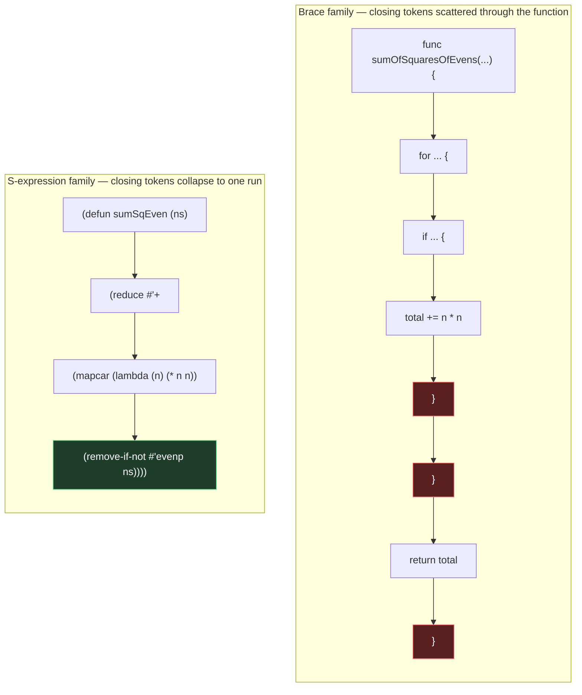

+++
title       = "Lisp Beats Every Modern Language on Token Cost"
date        = "2026-07-05"
draft       = false
description = "Lisp was AI's first language. It is also the cheapest one. Modern tokenizers punish boilerplate and reward structural minimisation, and Lisp's whitespace agnosticism, implicit returns, and macro-driven DSLs give it a compression ceiling that Go, Java, and TypeScript cannot structurally reach."
slug        = "26-lisp-token-cost"
keywords    = ["LLM", "tokenization", "Lisp", "token golf", "context window", "performance", "macros", "software architecture"]
tags        = ["infrastructure", "devops", "foss", "selfhosted"]
categories  = ["articles"]
schema_type = "TechArticle"
aeo_expertise = "LLM Context Engineering, Lisp, Software Architecture"
aliases     = ["/26-lisp-token-cost/"]
og_image    = "/assets/og-posts.png"
series      = ["Infrastructure Independence"]

[[diagrams]]
  title   = "Closing-token structure: brace family versus S-expression family"
  alt     = "Two-column flowchart. Left column, labelled brace family, shows the Go implementation of sumOfSquaresOfEvens as eight sequential steps, with the three closing braces highlighted in red and scattered at the points where the for loop, if statement, and function body each end. Right column, labelled S-expression family, shows the equivalent golfed Lisp function as four sequential steps, with the four closing parens highlighted in green and collapsed into a single run at the end of the final line."
  caption = "Brace-closing tokens are scattered through the function body; paren-closing tokens collapse to one run at the end of the expression."

[related_post]
  slug  = "23-lisp-attestation-hackers"
  label = "post 23 covers a related argument about the exact boundary Lisp's extensibility dissolves in attestation pipelines"
+++

# Lisp Beats Every Modern Language on Token Cost

<p>Context windows are priced per token, not per character, and not per line of "readable" code. Modern tokenizers (o200k_base, Claude's tokenizer family) build their vocabularies from corpus frequency. Natural-language words compress into single tokens because English text dominates training corpora. Programming language syntax does not get the same courtesy — every language pays a structural tax, and the size of that tax is a function of how much boilerplate the grammar requires before intent gets expressed.</p>

<p>Go, Java, and TypeScript — call them the brace family — carry fixed syntactic overhead that has nothing to do with the algorithm. It exists for the compiler, not for the idea being expressed. Lisp's grammar carries almost none of it. S-expressions are closing-paren-terminated rather than keyword-terminated, and whitespace is purely cosmetic. That gives Lisp a lever the others structurally lack; a compressible shape of the code and names inside it.</p>

<p>Here we see a measurable payload reduction for anything injected into an LLM context window — RAG snippets, few-shot examples, tool definitions, or code review context.</p>

<p>The same function — sum the squares of the even numbers in a list — looks like this in three mainstream languages.</p>

**Go**

```go
func sumOfSquaresOfEvens(numbers []int) int {
	total := 0
	for _, n := range numbers {
		if n%2 == 0 {
			total += n * n
		}
	}
	return total
}
```

**Java**

```java
public static int sumOfSquaresOfEvens(List<Integer> numbers) {
    int total = 0;
    for (int n : numbers) {
        if (n % 2 == 0) {
            total += n * n;
        }
    }
    return total;
}
```

**TypeScript**

```typescript
function sumOfSquaresOfEvens(numbers: number[]): number {
  return numbers
    .filter((n) => n % 2 === 0)
    .reduce((total, n) => total + n * n, 0);
}
```

<p>Each language carries a fixed overhead tied to its core grammar. A model cannot optimise that overhead away, and it persists whether or not the model needs it to understand the operation.</p>

<p>The equivalent, written as standard, readable Lisp:</p>

```lisp
(defun sum-of-squares-of-evens (numbers)
  (reduce #'+ (mapcar (lambda (n) (* n n))
                       (remove-if-not #'evenp numbers))))
```

<p>Already shorter, and it has no closing braces to speak of — just one paren stack that a tokenizer treats as a handful of single-character tokens rather than multi-character keyword tokens. But this is still readable Lisp; we have yet to apply token golf strategies to it.</p>

```lisp
(defun sumSqEven(ns)(reduce #'+(mapcar(lambda(n)(* n n))(remove-if-not #'evenp ns))))
```

<p>For a brace-family programmer, the structural difference is easier to see than to explain in prose. Every open brace in Go, Java, or TypeScript needs its own matching close brace, scattered wherever the nesting happens to end. Every open paren in Lisp closes the same way, but the closes all land in one run at the point the expression is actually finished.</p>



<p>Three changes did the work:</p>

<ol>
<li><strong>camelCase over kebab-case for short-lived identifiers.</strong> <code>sumSqEven</code> is one contiguous token-friendly string; <code>sum-of-squares-of-evens</code> forces the tokenizer to either split on hyphens or burn a longer subword sequence, because BPE vocabularies are trained overwhelmingly on prose and code identifiers that use underscores or camelCase, not hyphens.</li>
<li><strong>Zero non-semantic whitespace.</strong> The Lisp reader does not care whether a space precedes <code>(</code>. Every space removed where the reader can still disambiguate tokens (symbol vs. next open-paren) is a token that no longer needs to be paid for.</li>
<li><strong>Argument name shortening.</strong> <code>numbers</code> becomes <code>ns</code>, <code>n</code> stays <code>n</code>. This has a floor — a name cannot be shortened past what a competent reader needs to hold semantic state in a one-shot injection — but for anything the model is not going to be asked to maintain long-term, short binding names are a legitimate lever within a controlled scope.</li>
</ol>

<p>The compression above is surface-level — it still expresses the full computation. The deeper move is macro-driven DSL design, where a single symbol expands into a structural pattern that would otherwise cost dozens of tokens to spell out by hand. This is where Lisp categorically outperforms the brace family: none of these example third generation languages allow the grammar itself to be extended, and Lisp does.</p>

```lisp
(defmacro defpipe (name &rest steps)
  "Define NAME as a function that threads its argument through STEPS in order."
  `(defun ,name (x) ,(reduce (lambda (acc step) `(,step ,acc)) steps :initial-value 'x)))

(defpipe normalizeAndScore
  #'string-downcase
  #'string-trim
  #'compute-score)
```

<p><code>defpipe</code> expands into a full <code>defun</code> with a threaded call chain. In a context window, <code>(defpipe normalizeAndScore #'string-downcase #'string-trim #'compute-score)</code> is roughly a dozen tokens. The equivalent hand-written Go version — a named function with three sequential reassignments and an explicit return — runs well past thirty tokens before a single comment has been added. That gap holds at every call site, and it compounds each time the macro appears in a prompt, few-shot example, or tool spec.</p>

<p>This is the structural advantage word-based optimisation cannot touch: English-heavy tokenizers already compress common English words into single tokens, but they cannot compress a pattern of code into one token unless the language lets a developer name the pattern and have the compiler expand it back out. Macros are how Lisp does that at the source level, before the tokenizer ever sees the string.</p>

<p>Rough token counts using a GPT/Claude-class BPE tokenizer, same algorithm, four implementations:</p>

<table>
<tr><th>Implementation</th><th>Approx. tokens</th><th>Notes</th></tr>
<tr><td>Go (readable)</td><td>58</td><td>Type keywords, braces, explicit return each cost separately</td></tr>
<tr><td>Java (readable)</td><td>61</td><td>Access modifier and generic type erasure syntax adds overhead</td></tr>
<tr><td>TypeScript (functional style)</td><td>42</td><td>Arrow functions and chaining reduce brace count vs. Go/Java</td></tr>
<tr><td>Lisp (readable, kebab-case)</td><td>34</td><td>No braces; hyphenated name still costs multiple subword tokens</td></tr>
<tr><td>Lisp (token golf, camelCase, zero whitespace)</td><td>24</td><td>Single-token identifier, minimal reader-required whitespace</td></tr>
<tr><td>Lisp (macro-abstracted call site)</td><td>12</td><td>Boilerplate lives in the macro definition, paid once, not per call site</td></tr>
</table>

<p>Due to commonalities in third-generation languages, the pattern holds across domains:</p>

<ul>
<li><strong>Boilerplate tokens are fixed costs.</strong> <code>public static</code>, <code>func</code>, closing braces, and explicit <code>return</code> do not scale with algorithm complexity — they are a flat tax paid on every function regardless of what it does.</li>
<li><strong>Structural tokens are cheaper than keyword tokens.</strong> A tokenizer represents <code>(</code> and <code>)</code> as single characters far more reliably than it represents <code>{</code>, <code>}</code>, and multi-word keywords, because parens appear in math notation and prose far more often than curly braces do, so they are better represented in the base vocabulary.</li>
<li><strong>Macro amortisation only exists where the grammar is extensible.</strong> Every call site of <code>defpipe</code> pays 12 tokens instead of 30+. Multiply that by the number of times a pattern like this appears across a codebase being fed into a context window as few-shot examples or RAG snippets, and the savings compound linearly with call-site count — something naming discipline alone does not replicate in the brace family, which has no mechanism to name a structural pattern and let the compiler expand it back out.</li>
</ul>

<p>The whitespace and naming compression above is an injection-time transform, and it has no place in a codebase anyone has to maintain. Macro-driven compression is a different story: dense, macro-heavy Lisp is a documented production tradition, most associated with the "Let Over Lambda" school of macrology — not a novelty of token golf, but a pattern that applies to systems well outside this argument. What changes for context-window injection is the scale of the payoff. A macro that saves a maintainer a few lines of typing saves a model dozens of tokens at every call site, and that gap compounds across a system prompt or RAG corpus in a way it never does across a single human-read file.</p>

<p>A live example sits closer to home than Go or Java. This site's own knowledge base — post, tag, and author facts asserted into a small Prolog engine — ships as a loadable Quicklisp system rather than a REST endpoint. A query like <code>(query '(tag ?s :selfhosted))</code> costs a handful of tokens either way, but the corpus loader that builds the underlying fact base is ordinary boilerplate: fine to write out in full for a human reading the source, worth compressing before it ever rides along in a RAG-retrieved context.</p>

<p>For anyone architecting a system that injects code into a model's context window at scale, token cost is an infrastructure line item, not a style preference — it belongs in the same cost-and-risk model as bandwidth, storage, or compute. The compression ceiling differs by language, and knowing which ceiling is actually in play is part of the due diligence, not an optimisation to defer until the invoice makes the case.</p>
